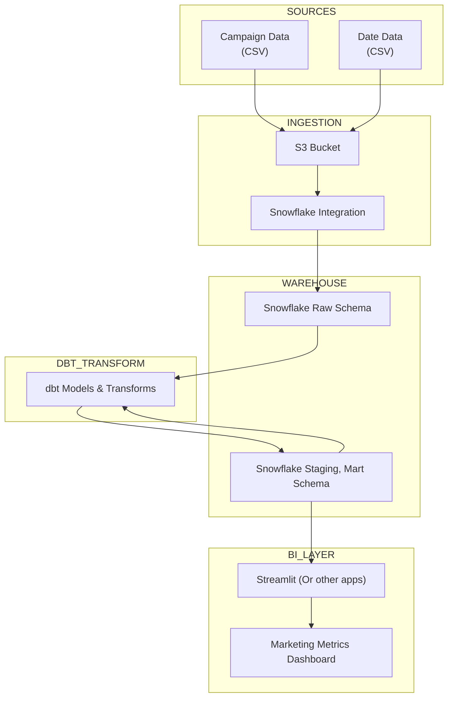

# Monarch Analytics Project

## Purpose

This Project delivers sample marketing analytics by generating synthetic data and showcasing a complete data pipeline. It provides insights into key metrics such as customer acquisition cost (CAC), lifetime value (LTV), and return on ad spend (ROAS).

## Architecture

The project demonstrates a modern data stack:

1. **Sample CSVs**: Synthetic data is generated and stored as CSV files.
2. **S3**: CSVs are uploaded to an S3 bucket for centralized storage.
3. **Snowflake**: Data is ingested into Snowflake for efficient querying and analysis.
4. **DBT**: DBT transforms raw data into analytics-ready datasets.
5. **Streamlit**: An interactive dashboard visualizes marketing metrics.

## Data Pipeline

1. **Data Generation**: Synthetic data includes:

   - `dim_campaigns`: Campaign metadata.
   - `dim_date`: Date dimension for time-based analysis.
   - `fact_ad_performance`: Daily ad performance metrics.
   - `fact_customer_revenue`: Customer revenue data.

2. **Data Storage**: Generated CSVs are uploaded to S3.
3. **Data Warehousing**: Data is loaded into Snowflake for analysis.
4. **Data Transformation**: DBT ensures data is clean and analytics-ready.
5. **Dashboard**: A Streamlit app visualizes marketing performance.

